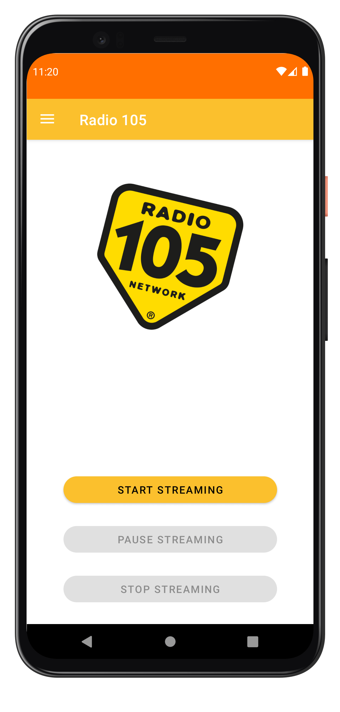
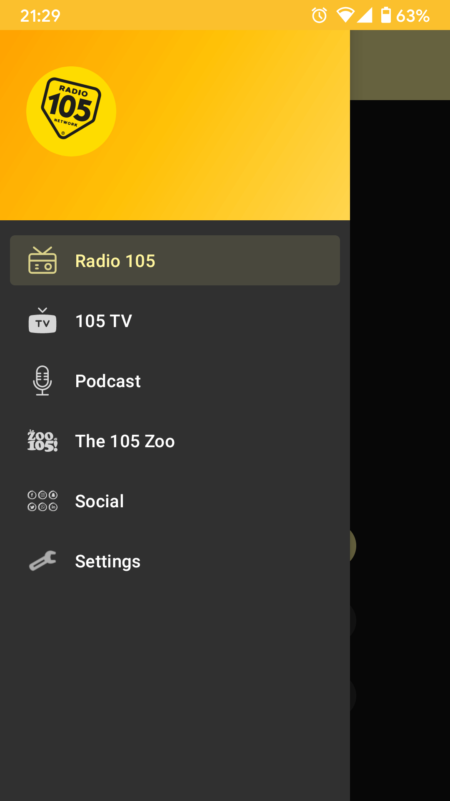
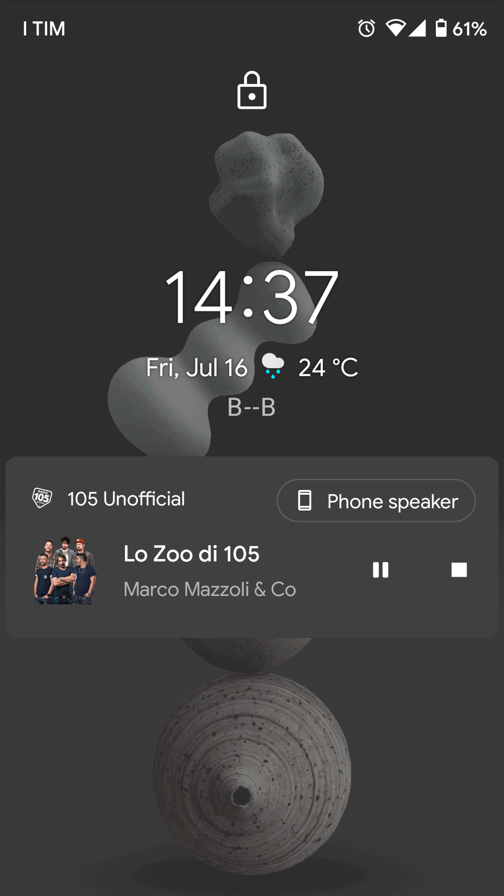
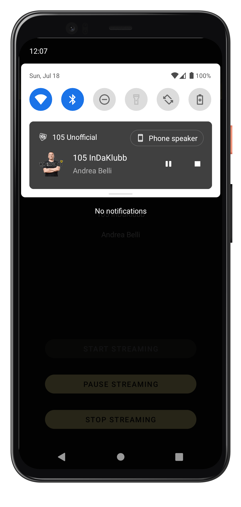
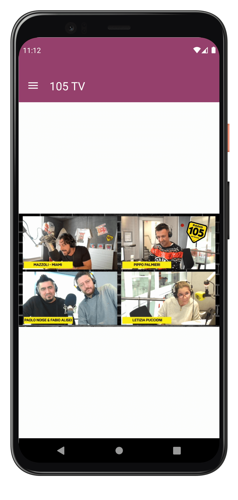
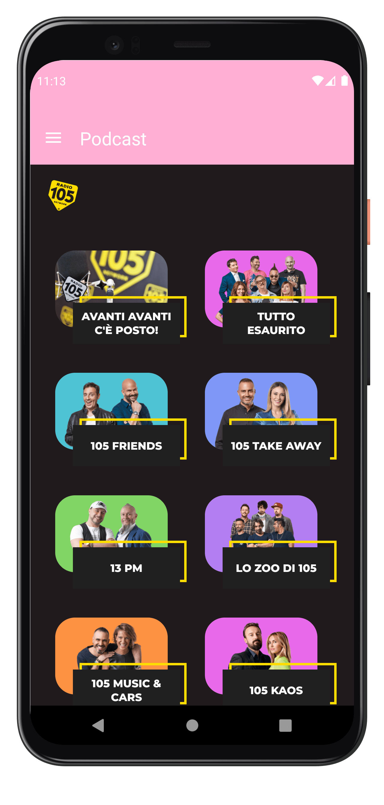
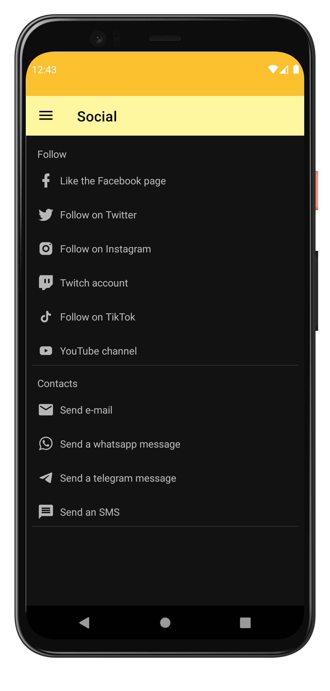
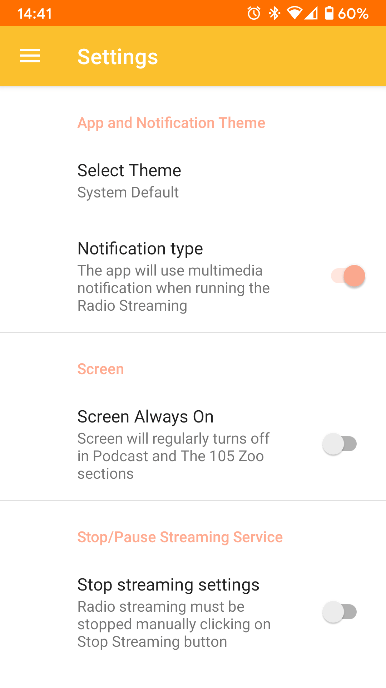

# Radio 105 Unofficial App

 
 

  

 
 

I've decided to start the development of this app tired of the bugs in the official app, especially with newer android versions.

 
 

**Features:**

* Completely open source
* Compatible with all devices running android Lollipop and above
* No Ads
* No external libraries except [AdBlockPlus](https://github.com/adblockplus/libadblockplus-android) webView for Podcast and The 105 Zoo sections, [jsoup](https://jsoup.org/) for parsing radio streaming metadata and [Timber](https://github.com/JakeWharton/timber) for logging.
* The radio streaming can be controlled with wearable devices or Android Auto
* Can be installed on android TV --> Tested with Android TV emulator
* Compatible with wearable devices --> Tested with Wear OS emulator and with Xiaomi Band 4 and 5
* Fully compatible with Android 12

 
 

**Permissions:**

* INTERNET
* ACCESS_NETWORK_STATE and ACCESS_WIFI_STATE: needed by recover stream option and for properly set the partial WiFi wakelock
* FOREGROUND_SERVICE: needed by the Radio streaming service. Without this Android will kill the streaming service after a few minutes when the screen is off
* WAKE_LOCK: needed by the radio streaming service when running. Without this there's the possibility that Android turns off the WiFi or send the CPU in deep sleep state when the screen is off even if the streaming service is running
* WRITE_EXTERNAL_STORAGE: this permission is NOT granted by default and will be asked only when the user tries to download a podcast from podcast or the 105 zoo sections. On Android versions >= 10 the permission is NOT required, the app will use the new scoped storage model implemented in Android 10. More info [here](https://developer.android.com/about/versions/11/privacy/storage)

 
 

**Sections:**

1. Radio: the place where the radio streaming can be started and controlled 
    * When the stream starts a notification with multimedia commands will be created
    * The stream can be stopped, paused and restarted even on secure lockscreen and with wearable devices

2. 105 TV: a simple fragment that stream 105 Tv channel from [Mediaset Play](https://www.mediasetplay.mediaset.it/) 
    * Automatically enable fullscreen when in landscape mode
    * Screen does not turns off when the user is in this section

3. Podcast: the [105.net](https://105.net) podcast section 
    * All ad and banners completely removed
    * Podcast can be listened and downloaded (write on storage permission is required for download on Android versions < 10)
    * No cookies
    * If for some reason a link can't be opened, the app will prompt the user to open it in an external browser

4. The 105 Zoo: the complete [zoo.105.net](https://zoo.105.net) site 
    * All ad and banners completely removed
    * Podcast can be listened and downloaded (write on storage permission is required for download on Android versions < 10)
    * No cookies
    * If for some reason a link can't be opened, the app will prompt the user to open it in an external browser

5. Social 
    * Provide links for all Radio 105 social accounts
    * Provide links for send a message to the program on air

6. Settings: the app options, some of them are available only for certain devices 
    * Instructions for properly run the radio streaming service on devices with MiUi/EMUI roms | **Only in MiUi and EMUI devices**
    * Theme: choose between light, dark or system theme *Default: system*
    * Notification type: allow user to choose between a standard or a multimedia notification during the audio streaming *Default: media notification* | **Removed in Android TV devices**
    * Screen on: keep the screen on when in podcast and the 105 zoo sections *Default: disabled* | **Removed in Android TV devices**
    * Stop streaming setting: allow system to stop streaming when app is removed from recent tasks *Default: disabled* **Removed in Android TV and in MiUi/EMUI devices**
    * Audio devices: pause streaming when an audio device (headset, BT, etc.) is disconnected *Default: enabled*
    * Reconnect stream: restart the radio stream after an error if internet is available  *Default: enabled*
    * Network change: restart the radio stream immediately when the device switch from mobile network to WiFi and vice versa  *Default: enabled*

 
 

## Download:

* [Latest version on GitHub](https://github.com/B--B/Radio_105_Unofficial/releases/latest)
* [Latest version on Play Store](https://play.google.com/store/apps/details?id=com.bb.radio105)
